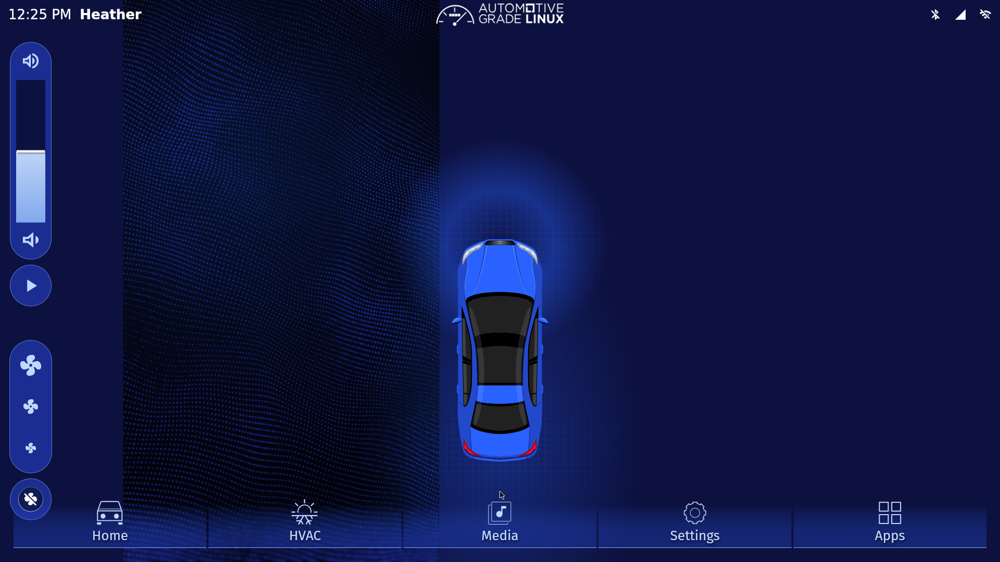

# AGL on WSL — 学生向け起動ガイド

Windows 11 の **WSL2 → Ubuntu 24.04 → QEMU → Automotive Grade Linux (AGL)** で、公式 Flutter IVI デモを起動するための手順とスクリプトです。AGL を WSL ディストリビューションとして直接起動する構成ではありません。



- 起動イメージ: **[検証済みイメージをダウンロード](https://github.com/e-lab-pius-project/agl-wsl-demo/releases/tag/agl-20261001)**
- イメージの出典とハッシュ: [images/README.md](images/README.md)
- CAN入力の試験: [docs/CAN.md](docs/CAN.md)

この画面は **IVI（ナビ・音楽・空調などの車載情報端末）** のデモです。メーターパネル専用の Instrument Cluster デモではありません。CAN の値を KUKSA まで届ける試験は実施済みですが、PIUS 専用メーター表示や実車接続は含みません。

## 1. 用意するもの

- Windows 11、Intel / AMD の x86-64 CPU、仮想化機能を有効にしたPC。
- WSL2 と WSLg、Ubuntu 24.04 LTS。
- 空き容量の目安は 15 GB 以上（Ubuntu・圧縮イメージ・展開データ・変更用ディスク）。
- QEMU に RAM 2 GB、仮想CPU 2個を割り当てます。

**RAM 8 GB の学生PCでの快適さは未検証です。** 検証機は RAM 約32 GB です。8 GB 機では他のアプリを閉じ、メモリ使用量を確認してください。この手順は配布イメージを起動するもので、重い Yocto のフルビルドは行いません。Windows 11 Home でも WSL2 は利用できますが、QEMU の KVM 利用可否はPC環境で確認します。

## 2. WSL と Ubuntu を入れる

**管理者 PowerShell** で実行します。既に Ubuntu 24.04 がある場合は、その環境を利用できます。

```powershell
wsl --install -d Ubuntu-24.04
wsl --update
```

要求された場合は Windows を再起動し、Ubuntu の初回画面でユーザー名とパスワードを設定します。

```powershell
wsl --version
wsl -l -v
wsl -d Ubuntu-24.04
```

`wsl -l -v` の VERSION が **2** であることを確認します。`wsl --version` に出る 3.x などの数字は WSL アプリの版であり、この VERSION とは別です。以下の Bash コマンドは **WSL の Ubuntu** で実行します。

## 3. ツールとリポジトリを準備する

```bash
sudo apt update
sudo apt install -y git curl xz-utils qemu-system-x86 qemu-system-gui qemu-utils openssh-client
git clone https://github.com/e-lab-pius-project/agl-wsl-demo.git
cd agl-wsl-demo
ls -l /dev/kvm
test -r /dev/kvm && test -w /dev/kvm && echo 'KVM OK'
echo "$DISPLAY"
```

`KVM OK` と DISPLAY の値が表示されることを確認します。KVM にアクセスできない場合は下の「困ったとき」を参照してください。

## 4. イメージを取得して起動する

```bash
bash scripts/prepare.sh
bash scripts/start.sh
```

`prepare.sh` は固定バージョンのカーネルとディスク（圧縮時約852 MiB）を GitHub Releases から取得し、リポジトリ内の SHA-256 と照合します。展開時は約5.7 GiBです。保存先は `~/agl-qemu`。元ディスクを読み取り専用にし、操作による変更は `agl-work.qcow2` に保存します。再実行しても既存の変更用ディスクは作り直しません。

QEMU のウィンドウが開き、AGL が起動します。起動完了には時間がかかります。起動コマンドを実行したターミナルは開いたままにします。初回の案内画面では Continue を押します。

### 画面が90度回転している場合

公式の未変更イメージを配布しているため、初回は画面の向きを調整します。別の Ubuntu ターミナルを開いてリポジトリへ移動し、以下を実行します。

```bash
bash scripts/ssh.sh
```

ここからは **QEMU 内の AGL** です。`root` のパスワードはこのデモでは空です。

```bash
test -e /etc/xdg/weston/weston.ini.original || cp -p /etc/xdg/weston/weston.ini /etc/xdg/weston/weston.ini.original
sed -i 's/transform=rotate-90/transform=normal/g' /etc/xdg/weston/weston.ini
systemctl restart agl-compositor
exit
```

GUIが再起動します。READMEの画面画像は、この向き調整後の状態です。

## 5. 接続と終了

**WSL の Ubuntu、リポジトリ内**で実行します。

```bash
# AGLのターミナルに入る
bash scripts/ssh.sh

# 別のWSLターミナルからAGLを正常終了する
bash scripts/ssh.sh poweroff
```

AGL 内で `exit` すると SSH 接続だけが終了します。`poweroff` は AGL と QEMU を終了します。通常の終了にはウィンドウの閉じるボタンを使わず、`poweroff` を使ってください。次回は `bash scripts/start.sh` だけで起動できます。

SSH の転送先は **WSL の 127.0.0.1:2222** で、LANには公開しません。初回のホスト鍵は `~/agl-qemu/known_hosts` に記録し、変更された鍵は自動で受け入れません。

## 6. ファイルの編集・転送

WSL 内のソースは Windows のエクスプローラーから `\\wsl.localhost\Ubuntu-24.04\home\<Ubuntuのユーザー名>\` で開けます。これは **WSL のファイル**であり、QEMU 内の AGL のファイルとは別です。

WSL で作ったファイルを AGL の `/tmp` に送る例（WSL で実行）:

```bash
scp -O -o UserKnownHostsFile="$HOME/agl-qemu/known_hosts" -P 2222 ./example.txt root@127.0.0.1:/tmp/
```

`-O` は従来の SCP 転送を指定します。SFTP や SSHFS にはゲスト側の SFTP サーバーが必要です。QEMU の共有フォルダー（9p / virtiofs）は、この構成では設定・検証していません。

## 困ったとき

| 症状 | 確認すること |
|---|---|
| `/dev/kvm` がない | WSL を更新し、WSL2、BIOS/UEFIの仮想化、Windows側の入れ子の仮想化対応を確認します。この手順は KVM 必須です。 |
| `/dev/kvm` の権限がない | 所有グループが `kvm` なら `sudo usermod -aG kvm "$USER"` を実行し、Ubuntu を終了して入り直します。`id` と KVM OK を再確認します。 |
| GUI が出ない | `echo "$DISPLAY"` と WSLg を確認します。`sudo` で起動せず通常の Ubuntu ユーザーで起動します。 |
| SSH が Connection refused | QEMU を起動し、ゲストの起動完了を待ちます。`tail -n 80 ~/agl-qemu/serial.log` を確認します。 |
| 2222番ポートが使用中 | 先に起動したQEMUがないか確認します。同時に複数起動しないでください。 |
| イメージ取得が失敗 | 通信と Releases を確認します。下記の公式配布元への切り替えも可能です。 |
| SHA-256 が不一致 | スクリプトは停止します。不一致のファイルだけを別名に退避し、再取得してください。照合を省略しないでください。 |
| 起動が重い | WindowsとWSLのメモリ使用量を確認します。GPU加速は未検証で、通常の `virtio-vga` 表示を使っています。 |

公式配布元から**同じ版**を取得する場合:

```bash
AGL_DOWNLOAD_BASE=https://download.automotivelinux.org/AGL/snapshots/master/2026-10-01-b3881/qemux86-64/deploy/images/qemux86-64 bash scripts/prepare.sh
```

任意の保存先にする場合は、prepare / start / ssh / CAN試験のすべてで同じ `AGL_DIR` を指定します。

```bash
export AGL_DIR="$HOME/agl-qemu"
```

qcow2 は元ディスクの絶対パスを参照します。準備後のデータフォルダーは、そのまま別の場所に移動しないでください。

## 検証記録

2026-10-01 の検証構成:

| 項目 | 値 |
|---|---|
| WSL アプリ / 実行方式 | 3.0.1.0 / WSL2 |
| WSL の Ubuntu | 24.04 LTS（既存環境の名前は `wsl-agl`） |
| QEMU | 8.2.2、KVM |
| AGL | 21.93.0 (vimba)、master snapshot |
| AGL カーネル | 6.18.39-yocto-standard |
| ゲスト割り当て | RAM 2048 MiB、vCPU 2 |
| 画面 | 1920×1080、WSLg / GTK / virtio-vga |

起動・ホーム画面・SSH接続・正常終了、KUKSAへの仮想CAN入力を確認しました。元の検証では `/opt/agl-qemu` を使用しています。本リポジトリでは学生が通常ユーザーで使えるよう `~/agl-qemu` を標準にしています。

準備処理の再実行と破損検出を検査するには、イメージ取得後に `bash tests/check-preparation.sh` を実行します。VM は起動せず、一時ディスクで検査します。

2026-10-06、本リポジトリのスクリプトで未変更の公式ファイルから新しい作業用ディスクを作成し、AGLの起動、SSH、画面向き変更、SCP転送、KUKSAへの車速入力（0 → 20 → 42 → 0 km/h）、正常終了を再確認しました。準備処理の再実行による既存ディスクの保持と、破損カーネルの拒否も確認済みです。Ubuntu自体の新規インストールやRAM 8 GB機での試験は行っていません。

## 公式資料

- [AGL: Using Ready Made Images](https://docs.automotivelinux.org/en/master/01_Getting_Started/01_Quickstart/01_Using_Ready_Made_Images/)
- [Microsoft: WSL のインストール](https://learn.microsoft.com/ja-jp/windows/wsl/install)
- [Microsoft: WSL の GUI アプリ](https://learn.microsoft.com/ja-jp/windows/wsl/tutorials/gui-apps)
- [QEMU: 起動オプション](https://www.qemu.org/docs/master/system/invocation.html)

AGL公式プロジェクトとは独立した学習用リポジトリです。イメージ内の各ソフトウェアと画面のロゴ等の権利は、それぞれの権利者に帰属します。[配布物と出典](images/README.md)を参照してください。
